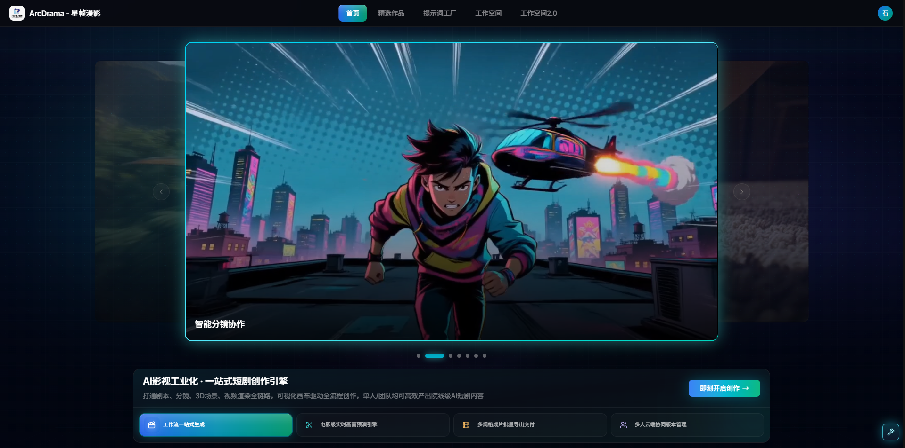
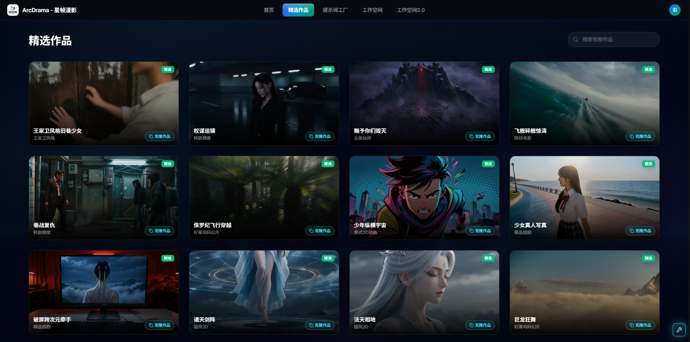
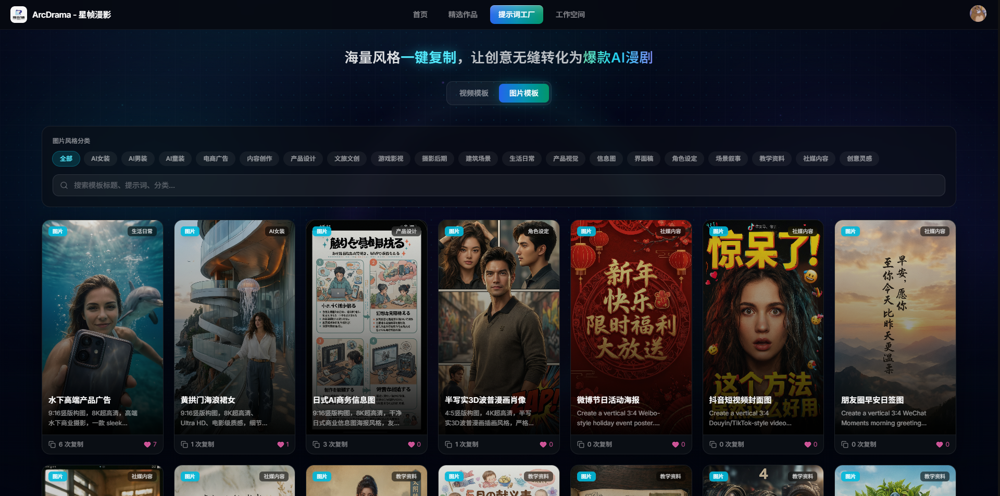
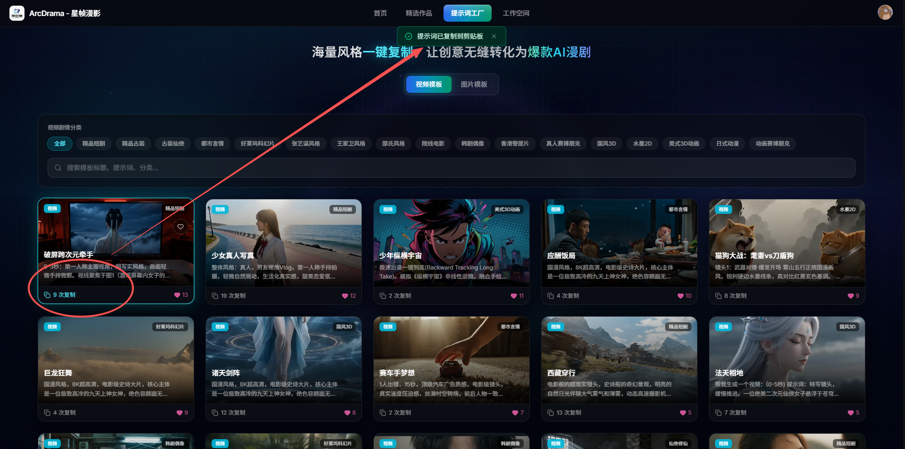
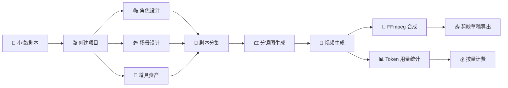
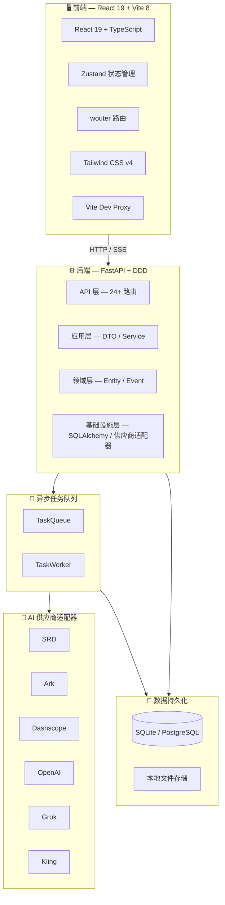

# ArcDrama

> **AI 漫剧生成平台 — 从小说到成片，一键编排**

[](https://www.python.org/)
[](https://fastapi.tiangolo.com/)
[](https://react.dev/)
[](https://www.typescriptlang.org/)
[](https://vitejs.dev/)
[](https://tailwindcss.com/)
[](./LICENSE)

 

---
### 🧩 提示词工厂

海量风格一键复制，让创意无缝转化为爆款AI漫剧。
| 功能模块 | 截图 |
|----------|------|
| **风格模板库** |  |
| **题材辐射图** |  |
| **角色设定** |  |
---
## ✨ 核心能力

| 能力 | 描述 |
|------|------|
| 🎭 **角色一致性** | 先设计角色形象，后续所有分镜自动引用，跨镜锁脸锁发型 |
| 🎬 **分镜编排** | 剧本自动拆解成分镜，支持手动调整机位、运镜、时长 |
| 🎨 **风格统一** | 内置 35+ 影视风格（吉卜力、赛博朋克、诺兰、黑泽明等），一键应用到全片 |
| 🎥 **多供应商视频** | 内置 SRD、可灵、Grok 等 6 大 AI 供应商，自动路由最优模型 |
| 🧵 **异步任务队列** | 生成任务后台排队执行，支持实时进度追踪与失败重试 |
| 📤 **剪映草稿导出** | 成片一键导出为剪映草稿，零门槛进入后期剪辑 |

---

## 🔄 工作流程



---

## 🚀 快速开始

### 前置要求

- Python >= 3.12
- Node.js >= 20.19.0
- pnpm >= 10.0
- FFmpeg

### Docker 部署（推荐）

```bash
# 1. 克隆仓库
git clone https://gitee.com/nanjing-srd/arc-drama.git
cd arc-drama/backend

# 2. 配置环境变量
cp .env.example .env
# 编辑 .env，填入你的 AI 供应商 API Key

# 3. 构建并启动
docker build -t arcdrama-backend .
docker run -p 1243:1243 --env-file .env arcdrama-backend
```

### 本地开发

**后端**

```bash
cd backend

# 创建虚拟环境
python -m venv .venv
source .venv/bin/activate  # Windows: .venv\Scripts\activate

# 安装依赖
pip install -e .

# 启动服务（含异步任务队列 Worker）
python -m ai_anidrama.run
```

服务启动后访问 `http://localhost:1243/health` 检查健康状态。

**前端**

```bash
cd frontend

# 安装依赖
pnpm install

# 启动开发服务器
pnpm dev
```

前端开发服务器默认运行在 `http://localhost:5173`，通过 Vite 代理自动连接后端。

---

## 📦 功能特性

- **项目管理** — 多项目并行，支持小说/剧本一键导入
- **角色设计** — 四格布局（胸像 + 三视图），支持风格参考图锁定
- **场景 & 道具资产** — 独立资产库，支持按项目复用
- **剧本编辑器** — 可视化分集管理，支持 AI 辅助扩写
- **分镜工作台** — 拖拽式分镜序列，实时预览画面构图
- **视频生成** — 接入多供应商，自动选择最优模型与参数
- **任务队列** — 异步处理生成任务，实时 SSE 推送进度
- **用量统计** — Token 消耗、视频时长、费用明细一目了然
- **代理商分销** — 多级代理体系，佣金自动结算
- **国际化** — 内置中/英/越三语界面

---

## 🤖 AI 供应商支持

| 供应商 | 文本生成 | 图像生成 | 视频生成 | 配置项 |
|--------|---------|---------|---------|--------|
| **SRD** | ✅ | ✅ | — | `SRD_API_KEY` / `SRD_IMAGE_API_KEY` |
| **Ark（火山方舟）** | ✅ | ✅ | ✅ | `ARK_API_KEY` |
| **Dashscope（通义）** | ✅ | ✅ | ✅ | `DASHSCOPE_API_KEY` |
| **OpenAI** | ✅ | ✅ | — | `OPENAI_API_KEY` |
| **Grok** | ✅ | — | — | `GROK_API_KEY` |
| **Kling（可灵）** | — | — | ✅ | `KLING_API_KEY` |

---

## 💬 加入社群

> 扫码加入微信群或飞书群，获取最新模型上线通知、优惠活动与技术交流。

<p align="center">
  
  &nbsp;&nbsp;&nbsp;&nbsp;&nbsp;
  
  <br/>
  <em>▲ 左：微信群 &nbsp;|&nbsp; 右：飞书群（如二维码过期请添加微信 zw1568633995）</em>
</p>

---

## 🏗️ 技术架构



---

## 🛠️ 技术栈

| 层级 | 技术 |
|------|------|
| **后端框架** | Python 3.12, FastAPI 0.115+, Uvicorn |
| **数据库** | SQLAlchemy 2.0, SQLite (开发) / PostgreSQL (生产) |
| **异步队列** | 自研 TaskQueue + TaskWorker |
| **视频处理** | FFmpeg, Pillow |
| **日志** | structlog |
| **前端框架** | React 19, TypeScript 5.8, Vite 8 |
| **状态管理** | Zustand |
| **样式** | Tailwind CSS v4, Radix UI, Headless UI |
| **路由** | wouter |
| **动画** | Framer Motion |
| **拖拽** | dnd-kit |
| **国际化** | i18next (中/英/越) |
| **测试** | Vitest, Testing Library |
| **包管理** | pnpm |
| **容器化** | Docker |
---
## 📖 文档

- [API 文档](backend/API_DOCS.md) — 后端接口详细说明
- [Postman 集合](backend/postman_collection.json) — 一键导入测试

---

## 🤝 贡献

欢迎提交 Issue 和 Pull Request！

```bash
# 提交前请确保代码通过检查
pnpm check        # 前端：类型检查 + lint + 测试
ruff check .      # 后端：代码风格检查
```

---

## 📄 许可证

本项目采用 [MIT 许可证](./LICENSE) 开源。

<!-- TODO: 如需商用授权或获取商业支持，请联系 support@njsrd.com -->
